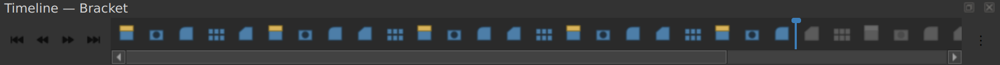
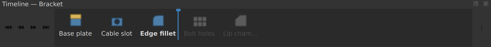
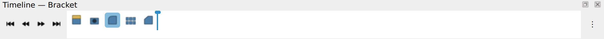
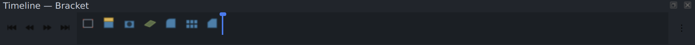
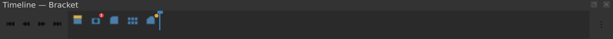
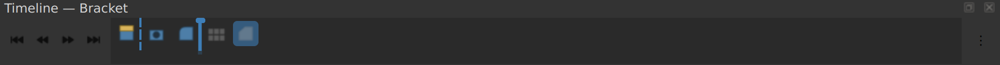
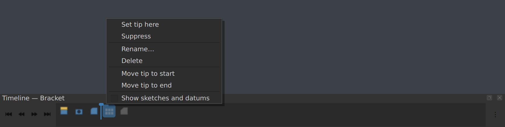
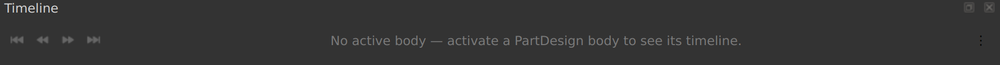

# Timeline

A horizontal, Fusion 360-style feature timeline for FreeCAD, docked at the
bottom of the main window.

It shows the active PartDesign body's features in `Group` order, with a
draggable rollback marker, suppression toggles, rename/delete, and
drag-and-drop reordering. Every mutation is a single undo step.

Requires **FreeCAD 1.0+**. Pure Python, PySide, works on Qt5 and Qt6 builds.



A compact icon strip pinned to the bottom of the window, laid out like Fusion's
own timeline: transport controls on the left, features left to right, the
rollback marker between them, options on the right. Rolled-back features dim.
Names are in the tooltip — turning them on is one item in the ⋮ menu, but the
strip then fits about a quarter as many features:



<details>
<summary>More states</summary>

Light theme, fully up to date:



Sketches and datums shown, on a second dark theme:



A feature that failed to recompute, and one that is merely out of date:



Mid-drag — dashed insertion line at the drop slot, marker being dragged:



Context menu:



No active body:



These are rendered offscreen from the real widget code by
`tools/render_screenshots.py` (`python tools/render_screenshots.py`, needs
PySide6). The document behind them and the feature icons are stand-ins — real
icons come from `feature.ViewObject.Icon`, which needs a FreeCAD GUI.

</details>

## Install

Via the Addon Manager, or manually:

```sh
ln -s "$PWD/freecad/Timeline" ~/.local/share/FreeCAD/Mod/Timeline
```

(macOS: `~/Library/Application Support/FreeCAD/Mod`, Windows: `%APPDATA%\FreeCAD\Mod`.)

Restart FreeCAD. The dock appears at the bottom and is listed under
**View → Panels**. It is not a workbench, so it stays available whichever
workbench is active.

## Using it

| Control | Effect |
| --- | --- |
| ⏮ ⏪ ⏩ ⏭ | Tip to start / back one / forward one / to end (skipping non-solids) |
| ⋮ | Show sketches and datums, show feature names |

| Gesture | Effect |
| --- | --- |
| Click | Select the feature (syncs with the model tree and 3D view) |
| Ctrl / Shift click | Extend the selection |
| Double click | Open the feature's task dialog |
| Drag the marker | Move the tip — features after it dim (rollback) |
| Drag a feature | Reorder it within the body; a multi-selection moves as a block |
| Right click | Set tip, Suppress/Unsuppress, Rename, Delete, tip to start/end |
| <kbd>Delete</kbd> | Delete the selection |
| <kbd>F2</kbd> | Rename the current feature |
| <kbd>Return</kbd> | Edit the current feature |
| <kbd>←</kbd> <kbd>→</kbd> | Move along the timeline |


Suppress and delete apply to the whole selection as a single undo step. A mixed
selection suppresses (only an all-suppressed one unsuppresses), which keeps the
toggle moving in one predictable direction.

Suppressed features render struck through and ghosted; rolled-back features
render dimmed.

A feature that failed to recompute gets a red **!** badge, and one that is out
of date gets an amber dot; the tooltip carries FreeCAD's own error text from
`getStatusString()`. Badges stay at full opacity even on a dimmed or suppressed
feature — a broken feature is what you are scanning for.

Styling is derived from the active `QPalette`, so it follows whatever theme is
loaded. The one exception is those two status colours: they are semantic, like a
traffic light, and tinting them with the theme accent would make an error badge
indistinguishable from the selection colour. Their hue is fixed and only their
lightness adapts.

The dock's visibility and position, and both ⋮ toggles, persist
across sessions (under `BaseApp/Preferences/Mod/Timeline`). Closing the dock
keeps it closed on the next start; **View → Panels** or the `Timeline_Show`
command brings it back for good.

## Layout

The interesting logic is deliberately kept out of the Qt classes so it can be
tested headlessly:

| Module | Imports Qt? | Role |
| --- | --- | --- |
| `model.py` | no | Reads `Group`/`Tip`/`BaseFeature`/`Suppressed`, classifies features, plans moves, validates dependency order |
| `commands.py` | no | Transaction-wrapped mutations |
| `observers.py` | no | Document + selection observers, forwarding to one callback |
| `settings.py` | no | Preferences via `App.ParamGet` |
| `qtcompat.py` | yes | PySide shim; Qt5/Qt6 enum spellings; `translate()` |
| `translations.py` | no | Registers `.qm` catalogues with FreeCAD |
| `theme.py` | yes | Palette-derived colours |
| `view.py` | yes | The feature strip, marker, drag-and-drop |
| `panel.py` | yes | Dock, transport controls, options menu, placeholder |
| `integration.py` | yes | Active-body tracking, wiring, context menu |

`model` and `commands` talk to document objects through a duck-typed subset of
the FreeCAD API, so the same code runs against real objects and against the
fakes in `tests/fakes.py`.

## FreeCAD behaviours this relies on

Verified against FreeCAD `master`; the source location is cited in each
docstring so they can be re-checked when FreeCAD changes.

- `Part::BodyBase` has `App::PropertyLink Tip`; assigning it is how rollback
  works (`BodyBase.h`).
- `getFullModel()` is `BaseFeature` followed by `Group` (`BodyBase.h`).
- `Body::isSolidFeature` = derives from `PartDesign::Feature`, is not a datum,
  and — if a `Transformed` — is not a MultiTransform child (`Body.cpp`).
- Only solid features (or the base feature) may be the tip
  (`CmdPartDesignMoveTip`, `CommandBody.cpp`).
- **`Body.insertObject` only inserts.** Reordering an existing member needs
  `removeObject` first, exactly as `CmdPartDesignMoveFeatureInTree` does —
  calling `insertObject` alone lists the feature twice.
- **`insertObject` is positional-only** (`PyArg_ParseTuple` in `BodyPyImp.cpp`);
  `after=True` as a keyword raises `TypeError`.
- `Body::removeObject` reassigns `Tip` to a neighbouring solid, so a reorder
  must save and restore it.
- Reordering must not put a feature before something it depends on; the check
  is ported from `CmdPartDesignMoveFeatureInTree`.
- `Suppressed` comes from `App::SuppressibleExtension`; PartDesign keeps
  `SuppressedShape`/`SuppressedPlacement` so the toggle is reversible.
- The active body lives under the `"pdbody"` key (`ActiveObjectList.h`).

## Tests

```sh
nix flake check                          # all three tiers, in the sandbox
nix develop -c pytest freecad/Timeline   # same, in a shell
```

or directly, if `import FreeCAD` already works:

```sh
cd freecad/Timeline && python -m pytest
```

Three tiers, each skipping cleanly when its dependency is absent:

- **Data layer** — always runs; uses `tests/fakes.py`, whose `FakeBody`
  reproduces `Body::insertObject`/`removeObject` semantics including their
  sharp edges.
- **Qt layer** — needs PySide6; runs offscreen. Renders the widget to a pixmap,
  so a broken paint path fails the test rather than printing a traceback.
- **Real FreeCAD** — needs an importable `FreeCAD` module
  (`test_freecad_integration.py`). Pins the API assumptions above so a FreeCAD
  change breaks the build instead of the GUI.

All 235 tests pass against **FreeCAD 1.0.2** (Python 3.13, PySide6 6.10) and
**FreeCAD 1.1.1** (Python 3.14, PySide6 6.11) — the 1.0.2 run is what validates
the `<freecadmin>1.0</freecadmin>` floor in `package.xml`.

## Running it from nix

```sh
nix run .#freecad-with-timeline     # FreeCAD with the addon already loaded
nix build .#freecad-timeline        # just the addon, as $out/Mod/Timeline
```

`freecad-with-timeline` wraps FreeCAD with `--module-path`, which maps to
`Config.AdditionalModulePaths`. `FreeCADInit.py` scans those with `flat=True`,
so the path is the module directory itself (`…/Mod/Timeline`), not a container
of modules. This keeps the addon in the store — versioned with the rest of the
closure, and never colliding with a copy installed by the Addon Manager.

`TESTING.md` has the manual checklist for everything a GUI is needed for.

## Translating

Every string in the Qt layer goes through `translate()`, so catalogues can be
extracted with `pylupdate6` and dropped into `resources/translations/`. See the
README there for the workflow and for why the undo-stack labels stay English.
