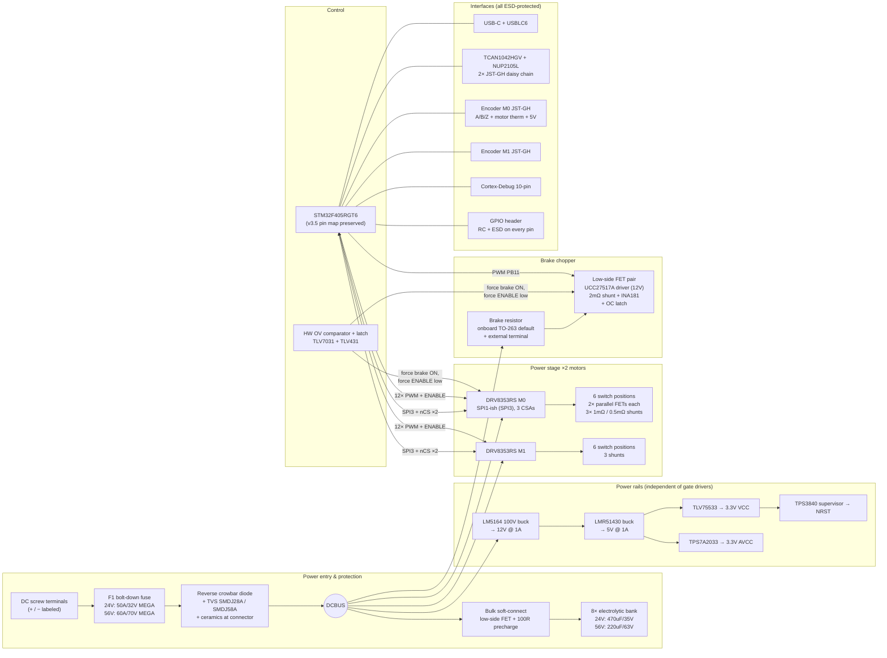

# ODrive v4 — Electrical Design Document

**Status:** design-complete, ready for schematic capture.
**Author:** v4 lead electrical design.
**Inputs:** `v3.5-weaknesses.md` (audit, 49 findings), `schematic_v3.5.pdf` (4 sheets), v3.5 netlist extraction (`netlist-ref/*.json`), `CHANGELOG.md`, firmware v0.5.6 (`Firmware/Board/v3`, `Firmware/Drivers/DRV8301`).
**Convention:** every block lists the audit finding IDs it closes (or deliberately deviates from). One PCB, two BOM variants: **24V** and **56V**. All references to "both variants" mean same footprint, different part value.

---

## 1. Goals & Constraints

Fixed decisions (not revisited in this document):

1. **MCU:** STM32F405RGT6 (LQFP64), preserving the v3.5/v3.6 pin mapping wherever possible so firmware v0.5.6 needs only a gate-driver port. Forced changes are flagged in the pin-map table (§3.7).
2. **Gate driver:** DRV8353RS (100 V abs-max, SPI, 3 integrated CSAs, integrated buck) replaces the NRND DRV8301 (closes **web-5**, **web-3** — the DRV8353 family has no spinning-start erratum).
3. **One PCB, two BOM variants:** 24V (60 V-class FETs, 35 V bulk caps) and 56V (100 V-class FETs, 63 V bulk caps). All power FETs on the same dual 5×6 mm PowerPAK/SO-8FL-class footprint pair per switch position.
4. **Form factor free.** Modern connectors: screw terminals for power/phases, USB-C, JST-GH keyed connectors for encoders and CAN.
5. **Protection first:** fuse, reverse-polarity strategy, TVS on bus/USB/CAN/encoders, hardware regen-overvoltage backstop independent of the MCU.

Derived performance targets:

| Parameter | 24V variant | 56V variant |
|---|---|---|
| Bus voltage, operating | 12–24 V nominal, 26 V max | 12–56 V nominal, 58 V max |
| Firmware OV trip (default) | 26 V | 58 V |
| Hardware OV backstop trip | 30 V | 60 V |
| Continuous phase current (with heatsink) | 40 A RMS | 40 A RMS |
| Peak phase current | 100 A | 80 A |
| Continuous DC bus current | 40 A | 40 A |

---

## 2. Architecture Overview

Three structural moves demanded by the audit's executive summary, all present:

1. **Protected power entry** — fuse + reverse crowbar + TVS + bulk soft-connect (§3.1).
2. **Hardware OV backstop independent of the MCU** — comparator latch that fires the brake chopper and kills gate-driver ENABLE (§3.1.4).
3. **Independent system power** — 100 V buck chain from DCBUS; no logic power passes through any gate driver (§3.6).

---

## 3. Block-by-Block Design

### 3.1 Bus Input & Protection

Closes: **bus-input-1, bus-input-2, bus-input-3, bus-input-4, bus-input-5, system-1, system-2, web-1, web-2, web-6, power-rails-7 (clamp aspect)**.

#### 3.1.1 Power entry & fuse (bus-input-1, system-2)

- **Connector:** 2-position 10.16 mm-pitch screw terminal rated 57 A (Phoenix PC 16/2-ST or Würth 691 311 500 102 class), silkscreened with **large filled "+" and "−" glyphs** plus "24V MAX" / "58V MAX" variant sticker area (system-2 fix, system-7).
- **Fuse F1:** bolt-down MEGA footprint (M5 studs), shared by both variants, always populated:
  - 24V BOM: Littelfuse MEGA 298 series, 50 A / 32 VDC (**0298050.ZXEH**).
  - 56V BOM: Littelfuse **MEGA 70V series, 60 A (0898060.UXEH)** — 60 A is the smallest member of the 70 V bolt-down line (no 50 A part exists in it), so the 56V variant runs a 60 A fuse; the extra I²t is re-coordinated against D_REV in Q1. Both series share the same MEGA bolt-down land pattern, preserving the one-PCB/two-BOM premise. (The Bussmann ANN/CNN fallback is rejected: different footprint.)
- Fuse sits between the "+" terminal and everything else; nothing on the board is upstream of it except the terminal.

#### 3.1.2 Reverse-polarity strategy (bus-input-2, web-1)

**Decision: crowbar + fuse, not a series ideal-diode stage.**

- D_REV: ST **STPS41H100CG-TR** — dual 100 V high-surge Schottky in D²PAK (2× 20 A legs, both halves paralleled), anode on PGND, cathode on DCBUS, placed immediately behind F1. Normally reverse-biased (leakage only). On a reversed hookup it clamps the bus at ≈ −0.7 V and carries the fault until F1 opens; the FET body-diode bank never conducts.
- Rationale for rejecting the series back-to-back-FET e-fuse (LM5069/LM74800 class): (a) at 40 A continuous, two series FETs burn 3–5 W and need heatsinking; (b) regen current must flow *back* into the supply, so a plain ideal diode is topologically wrong and a bidirectional controller (LM74800-Q1, 65 V) has no headroom on the 56V variant; (c) the crowbar is one lossless part shared by both variants. Cost of the tradeoff: a reversed hookup costs the user a fuse, not a board — exactly the behavior web-1's field reports beg for.
- D_REV surge: STPS41H100C IFSM ≈ 340 A per leg (10 ms half-sine); with both legs paralleled (derated for imperfect sharing, ≈ 600 A effective) it must ride out the fault until F1 opens — verify against F1's I²t, including the 56V variant's 60 A fuse, in open question Q1.

#### 3.1.3 Inrush / precharge (bus-input-3)

**Decision: soft-connect the bulk bank, keep the main power path series-element-free.**

- Only the ceramic bank (≈ 40 µF total: 100 nF + 2.2 µF at the connector per bus-input-5, plus 2× 2.2 µF/leg at each of 13 half-bridges, §3.2) sits directly on DCBUS — hot-plug arc energy drops ~100× versus v3.5's 3.76 mF.
- The electrolytic bank's PGND return goes through Q_SOFT (one FET of the shared bridge dual-footprint, BOM-shared: NVMFS5C628NL / BSC027N10NS5 per variant) with a 100 Ω / 2 W precharge resistor in parallel. Gate is charged from the 12 V rail through 1 MΩ into 1 µF with a 10 V gate-source Zener: the bank precharges through 100 Ω (τ ≈ 0.35 s), then Q_SOFT enhances and carries only capacitor ripple current (~10 A RMS × 0.8–1.4 mΩ ≈ 0.1 W).
- Failure modes: Q_SOFT fails short → inrush protection lost, board otherwise normal (benign); fails open → bulk bank disconnected, detectable as elevated bus ripple (firmware plausibility check, open question Q2).

#### 3.1.4 Regen overvoltage: layered defense (bus-input-4, system-1, web-2, web-6)

Four layers, outermost first:

1. **Firmware trip** (`dc_bus_overvoltage_trip_level`) at 26 V / 58 V — kept, cycle-by-cycle sampling as in v3.5 ("Not Broken" list).
2. **Hardware OV comparator, MCU-independent:** TLV7031 comparator + TLV431 reference off the buffered VBUS_S node (§3.4.3), threshold 30 V / 60 V (BOM-variant divider), ~1 V hysteresis plus a small latch (74LVC1G74 or comparator positive feedback) so it stays asserted until the bus falls below release (26 V / 55 V). Outputs:
   - forces the brake gate ON: `BRAKE_GATE = (PB11_PWM OR OV_LATCH) AND NOT BRAKE_OC_LATCH` (74LVC1G32 + 74LVC1G08);
   - forces gate-driver enable low: `DRV_ENABLE = PB12 AND NOT OV_LATCH` (74LVC1G08) — stops active regen pumping.
   Powered from 3.3 V VCC, which is independent of the MCU and of both gate drivers (§3.6).
   **Side effect (must be handled by firmware):** ENABLE held low > ~8 µs puts both DRV8353s into sleep, which resets *all* SPI registers (IDRIVE, TDRIVE, VDS_LVL, OCP_MODE, CSA_GAIN, CSA cal) to power-on defaults. Every OV-latch event therefore erases gate-driver configuration; recovery requires full re-init on the next ENABLE assertion — this is a **mandatory** port requirement, §5 item 8. No MCU pin observes OV_LATCH directly (pin budget, §3.7): firmware infers an OV event from VBUS_S history and/or a register-readback mismatch; a TMUX1208 upgrade would free a mux channel for a proper OV_LATCH status tap (Q4).
3. **Default-populated onboard brake resistor** (§3.11) — the safe state exists with zero user action.
4. **Bus TVS** across DCBUS–PGND at the connector, SMC footprint (shared): **SMDJ28A** (24V: standoff 28 V, V_BR min 31.1 V, clamp ≤ 45.4 V at full surge) / **SMDJ58A** (56V: standoff 58 V, V_BR min 64.4 V, clamp ≤ 93.6 V). Breakdown coordination with layer 2: minimum breakdown must sit *above* the hardware OV trip on both variants (31.1 V > 30 V; 64.4 V > 60 V), so a min-spec TVS is never in avalanche at a bus voltage the design declares sustainable — this is why SMDJ26A (V_BR min 28.9 V < 30 V trip) is rejected for the 24V BOM. Clamp sized under the variant FET rating per §3.2 margin math; last-ditch only (bus-input-5's analysis accepted — the TVS is not the primary regen absorber).

Back-driven motor with supply off (web-6): body diodes rectify onto the bus → layers 2–4 all still function (comparator and brake logic are powered whenever the bus is up, because the 12 V/5 V/3.3 V chain runs off DCBUS itself).

### 3.2 Power Stage

Closes: **power-stage-1, web-7, power-stage-3, power-stage-7, power-stage-8**; keeps the v3.5 parallel-dual-FET strategy per the audit's "Not Broken" list.

**Topology:** per motor, three half-bridges; each switch position = **two paralleled FETs on 5×6 mm footprints** (constraint 3), each FET with **its own gate resistor** at its gate pin (power-stage-3 fix), symmetric gate/source routing.

#### FET selection

| | 24V BOM | 56V BOM |
|---|---|---|
| Part | onsemi **NVMFS5C628NL** (SO-8FL 5×6, **60 V**) | Infineon **BSC027N10NS5** (TDSON-8 5×6) |
| V_DS | 60 V | 100 V |
| R_DS(on) @ 10 V, typ | 1.6 mΩ | 2.4 mΩ (2.7 mΩ max) |
| Q_g (typ, ≈) | ≈ 35 nC | ≈ 50 nC |
| Effective per switch (pair) | 0.8 mΩ | 1.2–1.35 mΩ |
| Alternate source | Infineon **BSC016N06NS** (60 V, 1.6 mΩ) — 40 V parts (e.g. BSC016N04LS) are **not** acceptable (40 V < 45.4 V TVS full-surge clamp) | onsemi NVMFS6H800NL is **not** acceptable (80 V < TVS clamp) |

**V_DS margin math (power-stage-1, web-2):**

- *24V:* worst sustained bus before the hardware backstop dumps = 30 V (comparator trip). Switch-node overshoot budget with per-leg decoupling and ≤ 5 nH loop: ≤ +5 V → 35 V ≤ 0.58 × 60 V. Steady-state derating 24/60 = 40 %. TVS full-surge clamp (45.4 V, SMDJ28A) sits comfortably below the 60 V B_VDSS — the 24V variant now satisfies the same clamp-below-rating rule as the 56V variant, with no reliance on FET avalanche capability.
- *56V:* worst sustained bus = 60 V (trip) + 8 V overshoot = 68 V ≤ 0.68 × 100 V. Steady-state derating 56/100 = 56 %. TVS clamp 93.6 V < 100 V even at full surge. This is why the 56V BOM must be 100 V-class, not 80 V.

**Conduction loss sanity (web-7):** at 40 A RMS phase, total bridge conduction ≈ 3 × I² × R_pair,hot ≈ 3 × 1600 × 1.3 mΩ ≈ 6.2 W (24V) / 10 W (56V) per motor plus switching — consistent with the 40 A-with-heatsink rating and honest no-heatsink derating (§6, system-5).

#### Switching cell hygiene

- **Per-half-bridge HF decoupling (power-stage-7):** 2× 2.2 µF X7R (50 V / 100 V per variant) directly drain-to-PGND at every leg (all 12 motor positions + brake), plus 100 nF in 0603 at each. Commutation loop no longer depends on the top-sheet ceramics' placement.
- **Snubber footprints (power-stage-7):** unpopulated R+C (0805+0805, start 1 Ω + 1 nF) across every low-side FET and the brake switch node — tunable on first hardware.
- **Gate resistors (power-stage-3):** 2× 2.2 Ω 0402, one per FET at the pin; net drive current set by DRV8353 IDRIVE (§3.3), which makes the resistor primarily a differential damper of the inter-gate loop.
- **High-side gate supply (power-stage-8):** the DRV8353 family has **no bootstrap pins** — high-side gate charge comes from the internal VCP trickle charge pump, so 100 % duty (including static high-side on) is supported by construction, with no per-phase passives at all. The only external charge-pump components are the datasheet set per device: **CPH–CPL flying cap 47 nF (100 V-rated X7R)**, **VCP–VDRAIN 1 µF / 16 V**, **VGLS–GND 1 µF**, alongside the VDRAIN 1 µF + 0.1 µF local decoupling (§3.3). Identical on both BOM variants.
- **Gate pulldowns (system-7 generalization):** 10 kΩ from every INHx/INLx MCU line to GND (all 12 PWM lines + brake PWM), so DFU-mode weak pull-ups can never bias a bridge — extends the v3.5 R59/R60 fix to every gate-control line. (DRV8353 additionally holds all gates low when ENABLE is low and has internal input pulldowns.)

### 3.3 Gate Drive — DRV8353RS Configuration

Closes: **web-5, web-3, power-stage-6 (GVDD abuse becomes moot), system-3 (partially — see deviation), sensing-6 (DC_CAL pin gone; SPI cal used)**.

Two **DRV8353RS** (VQFN-48), one per motor. PVDD/VDRAIN direct to DCBUS (9–95 V operating, 100 V abs max — both variants covered by one part, one more BOM line unified).

| Setting | Value | Register / field | Rationale |
|---|---|---|---|
| PWM mode | 6× PWM | 0x02 `PWM_MODE = 00` | Same as v3.5; STM32 TIM1/TIM8 complementary outputs with MCU dead time preserved |
| Gate drive current | IDRIVEP = 700 mA, IDRIVEN = 1400 mA initial | 0x03/0x04 `IDRIVEP_HS/LS`, `IDRIVEN_HS/LS` | ≈ 70 nC pair charge in ~100 ns; tune on hardware against ringing/EMI |
| t_DRIVE | 1000 ns | 0x04 `TDRIVE` | > longest expected Miller plateau at chosen IDRIVE |
| Dead time (driver-inserted) | 100 ns | 0x05 `DEAD_TIME = 01` | Backstop under the MCU-timer dead time (which remains authoritative, as on v3.5) |
| VDS OCP | latched shutdown; VDS_LVL = 0.2 V (24V) / 0.26 V (56V) | 0x05 `OCP_MODE = 01`, `VDS_LVL` | 24V: 0.2 V / 1.3 mΩ(hot pair) ≈ 150 A; 56V: 0.26 V / 2.0 mΩ ≈ 130 A. Deglitch `OCP_DEG` = 4 µs |
| CSA | bidirectional, VREF/2, gain per §3.4 | 0x06 `CSA_GAIN`, `VREF_DIV = 1`, `LS_REF = 0` (SPx–SNx across shunt) | Three amps, kelvin shunts |
| Auto offset cal | SPI-triggered at boot | 0x06 `CSA_CAL_A/B/C` (and 0x07 on DRV8353) | Restores what v3.5's DC_CAL removal lost (sensing-6, power-stage-4) |
| CBC | on | 0x04 `CBC` | OCP retry behavior defined |
| VREF pin | AVCC (3.3 V) | — | CSA outputs centered at 1.65 V into the STM32 ADC, same signal convention as DRV8301 |

**Fault architecture (system-3 — deliberate partial deviation):**
- DRV8353 has no nOCTW pin (warning tier lives in SPI Fault Status 2: `OTW`, `SA_OC/SB_OC/SC_OC`), so the unconnected-nOCTW finding dissolves; firmware polls/reads on nFAULT edge.
- **Kept shared:** one ENABLE net driven by `PB12 AND NOT OV_LATCH` (§3.1.4) and one wired-OR nFAULT into PD2 — *preserving the v3.5 pin map and v0.5.6's shared-enable actuation* (constraint 1 outweighs the audit's per-axis wish; there are no free MCU pins — see §3.7). Mitigations: DRV8353's per-phase VDS/VGS/SO fault bits make SPI attribution one read; ENABLE power-state reset (v0.5.6 already pulses it globally); the hardware OV path acts without the MCU at all. Logged as accepted risk in §7.
- **Configuration volatility:** every register in the table above is lost whenever ENABLE stays low > ~8 µs (device sleep) — which every hardware OV-latch event causes (§3.1.4). All register writes must therefore be repeated, and verified by readback, on **every** ENABLE assertion, not just at boot — mandatory port requirement, §5 item 8. A wrong power-on-default CSA_GAIN silently corrupts current scaling, so this is a correctness requirement, not hygiene.
- GVDD is gone as a concept: DRV8353 gate rails (VCP/VGLS) are internal and strictly local — power-stage-6 and the web-4 lesson are closed structurally; decoupling per datasheet (CPH–CPL 47 nF flying cap, VCP 1 µF, VGLS 1 µF, VDRAIN 1 µF + 0.1 µF per device) referenced to quiet ground per §6.

### 3.4 Current & Voltage Sensing

Closes: **power-stage-4, sensing-1, sensing-2, sensing-3, sensing-6, sensing-7**.

#### 3.4.1 Phase current — three shunts per motor

- **All three legs** get kelvin-net-tie shunts (v3.5 scheme extended per the "Not Broken" list): Bourns **CSS2H-2512R** wide-terminal series — **CSS2H-2512R-1L00F, 1 mΩ (24V)** / **CSS2H-2512R-L500F, 0.5 mΩ (56V)**. Note the series carefully: the CSS2H-2512**K** series only covers ≈ 1.8–5 mΩ and has a *different terminal geometry*; both variant values here are R-series parts sharing the same wide-terminal land pattern, which is what keeps the shared-footprint variant scheme and the kelvin sense connection intact.
- DRV8353 CSA gains (choices 5/10/20/40 V/V): 24V default **20 V/V** → ±82.5 A full scale, ~40 mA/LSB but with 2× the shunt signal of v3.5 (sensing-2: 20 mV @ 10 A vs 5 mV); 56V default **40 V/V** → ±82.5 A. Firmware's requested-range snapping logic ports directly (§5).
- Dissipation check: 1 mΩ @ 40 A = 1.6 W in a ≥ 4 W-class part (24V); 0.5 mΩ @ 40 A = 0.8 W (56V). Derating at heatsink-plate temperature → Q6. ✔
- **SOx filtering (sensing-1, sensing-7):** DRV8353's specified CSA output drive allows a *designed* filter: 100 Ω series at the driver + 1 nF to AGND (≈ 1.6 MHz pole for the VDS-transient edge), then **100 Ω + 47 pF to AGND directly at each STM32 ADC pin** as local charge reservoir. Pairs routed adjacent over AGND.
- SO3 (phase A) of each motor routes to PA2/PA3 through **default-closed solder jumpers**; future firmware gets true 3-phase sensing; a user who needs GPIO_3/4 back cuts the jumpers. (Forced pin change, flagged §3.7.) **Caution — not ignorable by v0.5.6 as shipped:** PA2/PA3 are GPIO3/GPIO4, and stock v0.5.6 lets a user enable **UART_B (USART2, AF7)** or digital-output/PWM modes on them (`config.enable_uart_b`, `board.cpp` AF table); a push-pull USART2_TX would then fight the DRV8353 SO3 output through the closed jumper (~200 Ω total series → ~16 mA sustained contention). The port **must lock out UART_B and all output/PWM modes on GPIO3/GPIO4** while the board is built with jumpers closed (compile-time board flag; the MCU cannot sense jumper state). Users who cut the jumpers may re-enable those modes via the build flag. Mandatory port item, §5 item 9.

#### 3.4.2 DC_CAL (sensing-6)

Pin does not exist on DRV8353; offset calibration is the SPI `CSA_CAL_x` sequence run in `init()`. No floating control lines remain.

#### 3.4.3 Bus voltage (sensing-3)

- Divider from DCBUS: **10 k / 1 k (24V, ratio 11)** and **18 k / 1 k (56V, ratio 19)** — deliberately matching firmware's existing `VBUS_S_DIVIDER_RATIO` (11.0 / 19.0 in `Board/v3/Inc/board.h`; the 19.0 branch guards on `HW_VERSION_VOLTAGE >= 48`, so it holds at 56 too).
- **56V firmware OV default — explicit, not inherited:** v0.5.6 defaults `dc_bus_overvoltage_trip_level = 1.07f * HW_VERSION_VOLTAGE` (`odrive_main.h`). Riding the shipped 48 V build constant would trip at **51.4 V** — the board could never reach 56 V nominal. And merely defining `HW_VERSION_VOLTAGE = 56` yields 1.07 × 56 ≈ **59.9 V**, sitting on top of the 60 V hardware backstop. The port therefore does **both**: defines `HW_VERSION_VOLTAGE = 56` (keeping `VBUS_S_DIVIDER_RATIO = 19.0` via the ≥ 48 guard) **and pins the config default `dc_bus_overvoltage_trip_level = 58.0f`** in the board config, giving the §1 table's 58 V firmware trip with 2 V of daylight under the hardware comparator. §5 item 9.
- Divider node → **TLV9062** unity buffer (½ of dual, AVCC-powered) → 100 Ω / 1 nF → **PA6** ADC (pin preserved; note: the v3.5 netlist places VBUS_S on PA6/U2.22, matching firmware ADC1 injected usage). BAT54S clamp on the divider node to AVCC/AGND. Second comparator tap for the hardware OV latch comes off the buffered node (§3.1.4), so the trip path no longer depends on ADC sample-time loading.
- Divider corner set by 1 nF at buffer input ≈ 50 kHz — fast enough for cycle-by-cycle trip, slow enough to reject switching hash.

### 3.5 Temperature Sensing

Closes: **sensing-4, system-5 (sensor aspect)**.

- **Onboard FET NTCs:** M0_TEMP (PC5) and M1_TEMP (PA4) keep the exact v3.5 divider (10 k NTC from AVCC, 3.3 k + 2.2 µF to AGND) so v0.5.6's thermistor polynomial works unchanged. Each NTC is *placed at the thermally-worst phase leg* identified in layout (system-5). **Firmware plausibility window required:** reading near either rail (open NTC → ~0 V) must raise a sensor fault instead of "cold" (sensing-4; documented in §5 port notes — a check, not a coefficient change).
- **Brake NTC:** AUX_TEMP on PA5, unchanged divider.
- **Motor thermistors (new):** each encoder connector carries a MOTOR_THERM pin: 10 k pull-up to AVCC, 1 k series + 100 nF to AGND, PESD3V3L1BA clamp. Open circuit (no thermistor fitted) reads ≈ AVCC → firmware treats near-rail as "not fitted / fault", never as a temperature. Both channels go to the **TMUX1204 analog mux** (§3.7 pin plan): channels S1 = M0_MOTOR_THERM, S2 = M1_MOTOR_THERM, S3 = BRAKE_ISENSE (§3.11), S4 = USB_VBUS_SENSE (§3.8); common D → **PC4** (ADC); selects A0 = PB10, A1 = PB2 (pulled down 100 k, defaults to motor-therm pair).

### 3.6 Power Rails

Closes: **power-rails-1, power-rails-2, power-rails-3, power-rails-4, power-rails-5, power-rails-6, power-rails-7**.

**Decision: dedicated buck chain; the DRV8353RS integrated bucks are NOT used for system power.**

- The single-point-of-failure fix (power-rails-1) demands that no logic power pass through a gate driver: the documented most-common field failure (shorted FET killing the driver) must leave the MCU alive to open the brake path, log the fault, and annunciate. Even a diode-OR'd "backup" from M0's integrated buck would re-couple driver failure into the rail network, so both RS bucks are strapped off per datasheet (buck components DNP). The RS variant remains the constrained part choice; its buck is simply unused (spare-use note → open question Q3).

Rail chain (each stage independent of both DRV8353s):

| Rail | Part | Input | Output | Loads |
|---|---|---|---|---|
| 12 V | **TI LM5164** (100 V, 1 A synchronous, internal soft-start) | DCBUS (behind F1) via RC/ferrite | 12 V @ ≤ 1 A | Brake gate driver, 5 V buck, fan header (**≤ 150 mA budget**, silked) |
| 5 V | **TI LMR51430** (36 V in, 3 A capable — **spec'd at 1 A**, limited by the 12 V stage) | 12 V | 5 V @ ≤ 1 A | Encoder ports, CAN port power, USB-side logic, 3.3 V regulators |
| 3.3 V VCC | **TLV75533** LDO 500 mA | 5 V | VCC | MCU, CAN transceiver VIO, logic |
| 3.3 V AVCC | **TPS7A2033** high-PSRR LDO, ferrite-bead-isolated input (BLM21PG221 + 10 µF) | 5 V | AVCC | STM32 VDDA, DRV8353 VREF, dividers |

- **LM5164 at 100 V** closes power-rails-7 outright: even the 56V variant's TVS clamp excursion (93.6 V) is inside the buck's rating; no on-time marginality at 58 V. Internal soft-start closes power-rails-4's failure class by construction. One part, both variants.
- **12 V budget (must close at the LM5164's 1 A rating):** 5 V stage input at full 1 A load ≈ 5 V × 1 A / (0.9 × 12 V) ≈ **0.46 A**, UCC27517A brake driver ≤ 0.05 A, fan header ≤ 0.15 A → ≈ **0.66 A ≤ 1 A** with margin. This budget is *why* the 5 V rail is specified at 1 A rather than the LMR51430's 3 A capability, and why the fan header carries an explicit 150 mA budget.
- **5 V budget:** 3× TPS2553 ports limited to **≈ 250 mA each** (0.75 A worst-case aggregate) + 3.3 V regulators and USB-side logic ≈ 0.2 A → ≤ 1 A. 250 mA per port comfortably covers JST-GH-class encoders and a CAN node; loads beyond that belong on external supplies.
- **5 V rail filtering (power-rails-5):** 2× 22 µF X7R + 68 µF polymer at the LMR51430 output; ferrite + 10 µF before the AVCC LDO.
- **VDDA decoupling (power-rails-6):** 1 µF + 100 nF X7R directly at pin 13 on the AGND island (ST AN4073); 100 nF at each DRV8353 VREF pin.
- **Supervision (power-rails-2):** **TPS3840DL30** on VCC driving NRST (open-drain, 10 k + 100 nF on NRST); LM5164 PGOOD and LMR51430 power-good (divider + comparator if the part lacks PG) wired-OR into **GPIO_8-adjacent early-warning net → routed to a spare EXTI via the nFAULT pull-up bank? No —** routed to the MCU on the existing **nFAULT (PD2) wired-OR through an open-drain buffer**, so any rail degradation reads as a driver-class fault v0.5.6 already halts on; v4 firmware can then attribute via SPI (drivers clean) + mux ch. Production option bytes set **BOR Level 3** (documented in §5).
- **5 V on user connectors (power-rails-3):** every connector 5 V pin goes through its own **TPS2553DBV** current-limited load switch (**limit set ≈ 250 mA via R_ILIM**, fault flag) — one for each encoder port, one for the CAN/aux ports — with 10 µF local ceramic per port. A shorted encoder cable can no longer brown out the controller, and the aggregate port limit (0.75 A) fits the 5 V rail budget above.

### 3.7 MCU & Pin Map

Constraint 1: preserve v3.5/v3.6 mapping. Source of truth: v3.5 netlist extraction (`Top.json`), U2 = STM32F405RGT6 LQFP64. **Bold ⚠ rows are forced changes**; everything else is bit-identical to v3.5.

| LQFP64 | Port | v3.5 net | v4 net | Notes |
|---|---|---|---|---|
| 2 | PC13 | M0_nCS | M0_nCS | SPI3 CS, DRV8353RS M0 |
| 3 | PC14 | M1_nCS | M1_nCS | LSE pads unused, as v3.5 |
| 4 | PC15 | M1_ENC_Z | M1_ENC_Z | **Deviation from audit (interfaces-4):** kept on PC15 to preserve mapping; mitigated by series R + Schmitt buffer |
| 5/6 | PH0/PH1 | HSE 8 MHz | HSE 8 MHz | XT1 + 10 pF ×2 |
| 7 | NRST | nRST | nRST | + TPS3840, 10 k, 100 nF, ESD |
| 8 | PC0 | M0_SO1 | M0_SO1 (phase B CSA) | ADC123_IN10 |
| 9 | PC1 | M0_SO2 | M0_SO2 (phase C CSA) | |
| 10 | PC2 | M1_SO2 | M1_SO2 | |
| 11 | PC3 | M1_SO1 | M1_SO1 | |
| 14 | PA0 | GPIO_1 (UART4_TX) | GPIO_1 | RC + ESD |
| 15 | PA1 | GPIO_2 (UART4_RX) | GPIO_2 | RC + ESD |
| 16 | PA2 | GPIO_3 | **M0_SO3 ⚠** | Phase-A CSA; default-closed solder jumper; GPIO_3 lost. Firmware must lock out UART_B/output modes (§3.4.1) |
| 17 | PA3 | GPIO_4 | **M1_SO3 ⚠** | Ditto; GPIO_4 lost; same lockout |
| 20 | PA4 | M1_TEMP | M1_TEMP | Onboard NTC, divider unchanged |
| 21 | PA5 | AUX_TEMP | AUX_TEMP | Brake NTC |
| 22 | PA6 | VBUS_S | VBUS_S | Now buffered (TLV9062); ratio 11/19 preserved |
| 23 | PA7 | M1_AL (TIM8_CH1N) | M1_AL | |
| 26/27 | PB0/PB1 | M1_BL/M1_CL | M1_BL/M1_CL | TIM8_CH2N/CH3N |
| 28 | PB2 | GPIO_6 | **GPIO_6 / MUX_A1 ⚠** | Dual role; 100 k pulldown; user keeps GPIO_6 only if forfeiting mux ch S3/S4 |
| 29 | PB10 | AUX_L (TIM2_CH3) | **MUX_A0 ⚠** | Brake is single low-side switch now; v4 firmware reconfigures PB10 as GPIO output |
| 30 | PB11 | AUX_H (TIM2_CH4) | BRAKE_PWM | Same semantics: PWM high ⇒ dump on — v0.5.6-compatible |
| 33 | PB12 | EN_GATE | DRV_ENABLE (shared, ANDed with NOT OV_LATCH) | v0.5.6 shared-enable actuation preserved |
| 34–36 | PB13–PB15 | M0_AL/BL/CL | unchanged | TIM1_CHxN |
| 37–39 | PC6–PC8 | M1_AH/BH/CH | unchanged | TIM8_CHx |
| 40 | PC9 | M0_ENC_Z | M0_ENC_Z | |
| 41–43 | PA8–PA10 | M0_AH/BH/CH | unchanged | TIM1_CHx |
| 44/45 | PA11/PA12 | USB_DM/DP | USB_DM/DP | Now USB-C + USBLC6 |
| 46/49 | PA13/PA14 | SWDIO/SWCLK | unchanged | |
| 50 | PA15 | GPIO_7 (TIM2_CH1) | **GPIO_7 / SPI-encoder nCS (shared) ⚠** | Same net feeds the GPIO header pin and the buffered SPI-header nCS (§3.10); `abs_spi_cs_gpio_pin = 7`; SPI-encoder users leave header GPIO_7 unconnected |
| 51–53 | PC10–PC12 | SPI3 SCK/MISO/MOSI | unchanged | DRV8353 ×2 + guarded external branch |
| 54 | PD2 | nFAULT (wired-OR) | nFAULT (wired-OR, + rail-PG open-drain) | Deviation from audit system-3 kept deliberately |
| 55 | PB3 | GPIO_8 (TIM2_CH2) | GPIO_8 | |
| 56/57 | PB4/PB5 | M0_ENC_A/B (TIM3) | unchanged | |
| 58/59 | PB6/PB7 | M1_ENC_A/B (TIM4) | unchanged | |
| 60 | BOOT0 | DIP switch | Dedicated recessed 2-pin jumper/switch, 47 k pulldown | Separated from CAN termination (system-7) |
| 61/62 | PB8/PB9 | CAN_R/CAN_D (CAN1) | unchanged | |
| 24 | PC4 | GPIO_5 | **ADC_AUX (TMUX1204 common) ⚠** | Motor therms / brake I / USB VBUS; GPIO_5 lost |
| 25 | PC5 | M0_TEMP | M0_TEMP | |

Net user-GPIO change: GPIO 1, 2, 6, 7, 8 remain (6 conditionally, 7 shared with the SPI-encoder nCS); GPIO 3, 4, 5 are repurposed. UART (GPIO_1/2) and step/dir-capable TIM2 pins (GPIO_6/7/8) survive, so the common v0.5.6 configurations still work — except that UART_B on GPIO_3/4 is locked out while the SO3 jumpers are closed (§3.4.1).

### 3.8 USB-C

Closes: **interfaces-2, interfaces-6, system-6 (USB portion)**.

- **Connector:** USB-C 16-pin receptacle (GCT USB4105-GF-A), USB 2.0 only. CC1/CC2: 5.1 kΩ pulldowns (UFP). Micro-B's mechanical fragility (noted in interfaces-2) eliminated.
- **Protection:** USBLC6-2SC6 on D+/D− at the connector; PESD5V0S1BA + ferrite bead on VBUS; shield to GND via 1 MΩ ∥ 4.7 nF (no hard tie).
- 22 Ω series resistors at the MCU retained (R1/R3 equivalents).
- **VBUS detect (interfaces-6):** VBUS → 47 k/10 k divider + BAT54 clamp → TMUX1204 channel S4 → PC4. Polled attach/detach lets firmware gate the D+ pull-up (soft-connect) and re-enumerate cleanly. (Requires v4 firmware support; absent support, behavior equals v3.5.)

### 3.9 CAN

Closes: **interfaces-3, system-6 (CAN portion), system-7 (switch ergonomics)**.

- **Transceiver:** TI **TCAN1042HGV** (5 V supply, VIO = 3.3 V, ±58 V bus-fault tolerant — survives a miswire to full 56 V bus, ±12 V common mode).
- **Protection:** NUP2105L dual-line TVS at the connector; optional CMC footprint (DLW32SH101 class, DNP default).
- **Termination:** split — 2× 60 Ω + 4.7 nF to GND — behind a **dedicated 1-position DIP switch** (BOOT0 moved to its own jumper; no more shared block).
- **Connectors:** **2× JST-GH 4-pin in parallel** (daisy-chain in/out, Pixhawk-standard pinout: 1 = 5V*, 2 = CAN_H, 3 = CAN_L, 4 = GND). *5 V pin fed via TPS2553 load switch (§3.6).

### 3.10 Encoders & GPIO

Closes: **interfaces-1, interfaces-4, interfaces-5, interfaces-8, system-7, web-8**.

- **One keyed JST-GH 6-pin per axis:** 1 = 5V (via TPS2553), 2 = GND, 3 = A, 4 = B, 5 = Z, 6 = MOTOR_THERM. **No 3.3 V anywhere on encoder connectors** (interfaces-1: the 5 V-onto-VCC misplug class is eliminated by keying *and* by never co-locating the rails).
- **Per input (A/B/Z ×2 axes):** 100 Ω series + 1 nF to GND (τ ≈ 100 ns, fine to 1 MHz quadrature) → **SN74LVC2G17 Schmitt buffer** (3 dual packages) → MCU; 3.3 kΩ pull-up to VCC retained ahead of the filter (2 mA push-pull encoder compatibility, per v3.3 changelog rationale); **TPD4E05U06** ESD array per connector. Inputs 5 V-tolerant via buffer supply choice (74LVC powered at 3.3 V with 100 Ω limit — clamp current bounded; web-8).
- **SPI breakout (interfaces-5):** external SPI (for AS5047-class absolute encoders) leaves the board only through **470 Ω series resistors** on SCK/MISO/MOSI plus a buffered nCS line on a separate 6-pin JST-GH "SPI encoder" header. **The header nCS is driven by GPIO_7 (PA15)** through a 74LVC1G125 buffer — the only remaining numbered GPIO with a free timer-independent role that v0.5.6's `abs_spi_cs_gpio_pin` can address (set `abs_spi_cs_gpio_pin = 7`). The net is shared with the GPIO-header GPIO_7 pin (series-R isolated); a user running an absolute SPI encoder forfeits GPIO_7 on the header and must leave it unconnected (§3.7). Firmware requirement: mandatory DRV8353 register readback-and-verify (§5 item 8). The DRV nCS lines (PC13/PC14) never leave the board.
- **GPIO header (interfaces-8):** GPIO 1/2/6/7/8 on a shrouded header, every pin with populated 100 Ω series + RC footprint (v3.5's optional-RC pattern extended and default-populated) + one TPD4E05U06 per bank. **AVCC is not brought out anywhere** (interfaces-8 fix).
- **SWD (interfaces-7):** standard keyed 10-pin 1.27 mm Cortex-Debug (FTSH-105-01-L-DV-K). VTref = 3.3 V only — **no 5 V pin**. TPD4E05U06 on SWDIO/SWCLK/NRST.

### 3.11 Brake Resistor Stage

Closes: **power-stage-5, power-stage-6, sensing-5, system-4, bus-input-4 (dump-path aspect)**.

**Topology change: single low-side chopper.** Brake resistor from DCBUS (behind F1) to the switch node; switch = one dual-FET position (same bridge FETs, BOM-shared) to PGND through a **2 mΩ shunt**.

- Rationale: a low-side switch can be held on continuously (100 % braking duty) with no bootstrap (power-stage-5's bootstrap-only high side eliminated); shoot-through is impossible by construction (there is no second switch); the hardware OV latch can assert the gate directly; and the "+" terminal ambiguity of system-4 disappears (one side of the resistor is always DCBUS).
- **Gate driver:** UCC27517A single low-side driver powered from the **12 V rail** (§3.6) — no gate-driver-internal rail is abused (power-stage-6 closed). Gate input = `(PB11 OR OV_LATCH) AND NOT OC_LATCH` per §3.1.4; 47 k gate-source pulldown at the FETs.
- **Onboard default resistor (bus-input-4):** TO-263 thick-film **Bourns PWR263S-35 class, 50 Ω (24V BOM) / 150 Ω (56V BOM)**, populated by default — the safe dump state exists out of the box. External screw-terminal pair (7.62 mm) in parallel for a real braking resistor (2 Ω / 0.5–2 kW class); silkscreen labels both terminals explicitly ("DCBUS" / "BRK SW") per system-4.
- **Telemetry & protection (sensing-5, system-4):**
  - 2 mΩ low-side shunt → **INA181A2** (gain 50, **powered from 3.3 V AVCC**, ground-referenced) → (a) **TLV7031 comparator + latch** killing the gate within µs on over-current (shorted/undersized resistor ⇒ no longer bounded only by FET destruction), latch readable/resettable by firmware; (b) TMUX1204 channel S3 → PC4 ADC for resistor-presence check at first pulse, I²t accounting, and stuck-on detection.
  - **Supply-domain rationale:** the INA output feeds the TMUX1204 (3.3 V AVCC) and the TLV7031 — both with absolute-maximum input of V_DD + 0.5 V. A 5 V-supplied INA saturating during the very overcurrent this circuit exists to catch would violate that limit (latch-up / PC4 ADC-corruption risk), so the INA runs on 3.3 V: its output can never exceed the downstream rails. Scaling still closes: gain 50 × 2 mΩ = 0.1 V/A → ≈ 33 A full-scale on the unidirectional dump current, above the OC trip point.
  - Firmware policy (v4 port, §5): refuse closed-loop until a first-pulse current test confirms a dump path exists (system-1 fix item), unless explicitly configured for battery-sink operation.

### 3.12 Connector Summary

| Function | Connector | Protection |
|---|---|---|
| DC input | 2-pos 10.16 mm screw terminal, oversized +/− silk | F1 fuse, crowbar, TVS, soft-connect |
| Phases M0, M1 | 2× 3-pos 7.62 mm screw terminal, **A/B/C all labeled**, M0/M1 groups silked (system-7) | VDS OCP, shunts |
| Brake resistor | 2-pos 7.62 mm screw terminal (+ onboard default resistor) | OC latch, INA181, labeled |
| USB | USB-C 16-pin | USBLC6, VBUS TVS+ferrite, shield RC |
| CAN | 2× JST-GH 4-pin (daisy chain) | TCAN1042HGV, NUP2105L, split term on DIP |
| Encoders | 2× JST-GH 6-pin (A/B/Z/therm/5V/GND) | RC + Schmitt + TPD4E05U06, TPS2553 on 5 V |
| SPI encoder | 1× JST-GH 6-pin | 470 Ω series, buffered nCS from GPIO_7/PA15 (shared with GPIO header) |
| GPIO | shrouded 0.1" header (GPIO 1/2/6/7/8, 3.3 V, GND) | RC + ESD array; no AVCC, no 5 V/3.3 V adjacency |
| SWD | 10-pin 1.27 mm Cortex-Debug keyed | ESD array, no 5 V |
| BOOT0 | recessed 2-pin jumper, isolated from CAN switch | — |

---

## 4. BOM Variant Table (24V vs 56V diffs only)

Everything not listed is identical across variants (one PCB, one placement).

| Ref class | 24V BOM | 56V BOM |
|---|---|---|
| Bridge/brake/soft-connect FETs (28 pos) | onsemi NVMFS5C628NL, 60 V, 1.6 mΩ | Infineon BSC027N10NS5, 100 V, 2.7 mΩ max |
| Fuse F1 | Littelfuse MEGA 32 V, 50 A (0298050.ZXEH) | Littelfuse MEGA 70V, 60 A (0898060.UXEH); I²t re-check → Q1 |
| Bus TVS | SMDJ28A | SMDJ58A |
| Bulk electrolytics (8×, 10 mm pad) | 470 µF / 35 V, 105 °C low-ESR (Panasonic FR) | 220 µF / 63 V, 105 °C low-ESR (Panasonic FR) |
| Half-bridge ceramics (2.2 µF ×26) | 50 V X7R 1210 | 100 V X7R 1210 |
| Phase shunts (6×) | 1 mΩ CSS2H-2512R-1L00F | 0.5 mΩ CSS2H-2512R-L500F |
| Default CSA gain (firmware) | 20 V/V | 40 V/V |
| VBUS divider R_top | 10 kΩ (ratio 11) | 18 kΩ (ratio 19) |
| HW OV comparator divider | trip 30 V / release 26 V | trip 60 V / release 55 V |
| DRV8353 VDS_LVL (firmware) | 0.2 V | 0.26 V |
| Onboard brake resistor | 50 Ω TO-263 | 150 Ω TO-263 |
| Firmware build (§3.4.3) | `HW_VERSION_VOLTAGE = 24` | `HW_VERSION_VOLTAGE = 56`, default OV trip pinned to 58 V |
| Voltage sticker / silk field | "26 V MAX" | "58 V MAX" |

---

## 5. Firmware Port Notes (DRV8301 → DRV8353RS)

Scope of the port for v0.5.6 (`Firmware/Drivers/DRV8301/` → new `Drivers/DRV8353/`):

**Unchanged (by design of this board):** all TIM1/TIM8/TIM2-CH4 PWM pins, SPI3 + PC13/PC14 nCS, PD2 nFAULT polarity/wired-OR, PB12 enable actuation (still shared, still actuated outside the driver class as in `board.cpp`), SO1/SO2 → PC0–PC3 with the same VREF/2-centered, inverted-slope signal convention, VBUS_S ratio macros (11.0 / 19.0), thermistor dividers and pins.

**SPI transport:** same 16-bit frame: `[R/W(1) | ADDR(4) | DATA(11)]`, MSB first, mode 1 (CPOL = 0, sample on second edge) — the existing `spi_config_` works as-is. DRV8353 reads return data in the same lower 11 bits. The 8301's write-5-times workaround should be replaced by write-then-verify.

**Register map translation:**

| DRV8301 | DRV8353 equivalent |
|---|---|
| 0x00 Status 1 (FAULT, GVDD_UV, PVDD_UV, OTSD, OTW, FETxx_OC) | 0x00 Fault Status 1 (FAULT, VDS_OCP, GDF, UVLO, OTSD, VDS_HA…VDS_LC per-FET) |
| 0x01 Status 2 (GVDD_OV, device ID) | 0x01 Fault Status 2 (SA_OC/SB_OC/SC_OC, OTW, CPUV, VGS_HA…VGS_LC) |
| 0x02 Control 1: OC_ADJ (5-bit, mΩ table), OCP_MODE, PWM_MODE, GATE_RESET, gate current (2-bit) | 0x02 Driver Control (PWM_MODE, CLR_FLT, COAST, BRAKE, OTW_REP, DIS_GDF, DIS_CPUV, OCP_ACT); 0x03/0x04 IDRIVEP/N HS/LS + TDRIVE + LOCK; 0x05 OCP Control (OCP_MODE, OCP_DEG, VDS_LVL 4-bit **voltage** table, DEAD_TIME, TRETRY) |
| 0x03 Control 2: OCTW mode, GAIN (10/20/40/80), DC_CAL_CH1/2, OC_TOFF | 0x06 CSA Control (CSA_GAIN **5/10/20/40**, CSA_FS, VREF_DIV, LS_REF, CSA_CAL_A/B/C, SEN_LVL, DIS_SEN); 0x07 Calibration |

Key behavioral differences to encode:

1. **CSA gain set changes {10,20,40,80} → {5,10,20,40}** and shunts change (0.5 mΩ → 1 mΩ on 24V; 0.5 mΩ kept on 56V). `Drv8301::config()`'s snap-down loop ports directly with the new `gain_choices[] = {5,10,20,40}` and `SHUNT_RESISTANCE` per variant. Net full-scale at defaults: ±82.5 A both variants.
2. **OC threshold semantics:** 8301 `OC_ADJ` encoded a VDS table via 5 bits; 8353 `VDS_LVL` is a 4-bit voltage (0.06–2 V). Set 0.2 V (24V) / 0.26 V (56V); keep `OCP_MODE = latched`.
3. **Gate current:** replace 8301's 2-bit peak-current field with IDRIVEP/IDRIVEN (start 700/1400 mA) and TDRIVE = 1000 ns; expose as config for EMI tuning.
4. **Dead time:** program `DEAD_TIME = 100 ns` in 0x05; MCU timer dead time remains authoritative (unchanged).
5. **Calibration:** run `CSA_CAL_A/B/C` auto-offset at init (replaces the vestigial DC_CAL concept); then clear.
6. **Fault decode:** map new bits into `FaultType_e` (UVLO ≈ PVDD_UV, CPUV ≈ GVDD_UV analog, OTSD/OTW same names, per-FET VDS/VGS bits replace FETxx_OC). nOCTW never existed on this board's MCU side — no change.
7. **Enable timing:** DRV8353 t_wake ≤ 1 ms; keep the existing 20 ms settle. Reset-pulse trick (EN low ≥ 20 µs) still valid for fault clearing, or use `CLR_FLT`.
8. **Register re-init + readback-verify — MANDATORY, not a mitigation:** ENABLE low > ~8 µs (which every hardware OV-latch event forces, §3.1.4) puts the DRV8353s to sleep and resets all registers to power-on defaults; a defaulted CSA_GAIN silently corrupts current scaling. The port must (a) perform the full register write + readback-verify sequence on **every** ENABLE assertion, refusing PWM until it passes; and (b) run the periodic readback task with **reconfigure-on-mismatch** (this also covers interfaces-5 SPI-glitch exposure). Since no MCU pin observes OV_LATCH, firmware detects an OV event by VBUS_S history and/or a readback mismatch on re-enable — documented workaround; a proper status tap needs the TMUX1208 option (Q4).
9. **Board-level changes bundled into the port:**
   - PB10: reconfigure from TIM2_CH3 to plain GPIO output (MUX_A0). Brake PWM stays on PB11 with identical "high = dump" semantics; complementary-pin code path deleted.
   - **GPIO3/GPIO4 lockout (mandatory):** with the M0_SO3/M1_SO3 solder jumpers closed (factory default), reject/ignore `config.enable_uart_b` and any digital-output/PWM mode on GPIO3/GPIO4 (PA2/PA3) — otherwise USART2_TX drives against the DRV8353 SO3 outputs (§3.4.1). Gate re-enabling on an explicit "jumpers cut" build flag.
   - **56V build constants (mandatory):** `HW_VERSION_VOLTAGE = 56` (ratio 19.0 retained via the ≥ 48 guard) and default `dc_bus_overvoltage_trip_level` pinned to 58.0 V (§3.4.3). The 24V build uses `HW_VERSION_VOLTAGE = 24` (formula default 25.7 V ≈ the §1 26 V figure).
   - SPI-encoder nCS: `abs_spi_cs_gpio_pin = 7` (GPIO_7 / PA15, shared with the GPIO header — §3.10).
   - Thermistor plausibility window: near-rail readings ⇒ `THERMISTOR_DISCONNECTED` fault (sensing-4).
   - Optional (new features, not required to spin motors): third-shunt sampling on PA2/PA3; ADC_AUX mux scan (PC4) for motor therms / brake current / USB VBUS; brake first-pulse dump-path test; BOR Level 3 option byte in production flashing.

---

## 6. PCB Strategy

Closes: **web-4 (lesson), system-5, system-7 (silkscreen)**; carries forward every "Not Broken — Keep" item.

**Form factor & assembly (decided 2026-09-04): two placement variants kept.**
The ODrive v3.6 board is **140.5 × 50 mm** (measured from the open-source Altium
`PCB.PcbDoc`: copper envelope 1043–6575 mil × 1083–3051 mil; outline ~141 × 51 mm), a
2.8:1 long-thin card — 8 electrolytics in a centre row, DC + phase screw terminals along
the bottom long edge, MCU/logic in a top-centre band, the two motor cells left and right,
FETs on **both sides**. v4 carries protections the original lacks (fuse + crowbar + TVS,
USB-C, OV comparator chain, supervisor, mux, per-port load switches), so it runs ~378
placed parts vs the original's ~300 — and the MEGA fuse F1 alone is 60.8 mm wide, a part
the ODrive floor plan has no place for. Two board files are kept, same schematic / netlist
/ BOM:

- **`odrive-v4.kicad_pcb` — single-sided (the prototype default).** All parts on top,
  ~160 × 90 mm. Chosen for the first spin: single-side SMT is roughly half the JLCPCB
  assembly cost at qty 2–5, everything is probeable and reworkable during bring-up, and one
  heatsink covers all the FETs. Bigger board, but size is not a constraint for a bench
  prototype (a DD wheelbase or robot has room). Adapt the ODrive commutation-loop geometry
  rather than copying it.
- **`odrive-v4-2side.kicad_pcb` — double-sided (the compact / production variant).**
  ~155 × 62 mm, ODrive-structured: power on the bottom (motor cells M0/M1 left+right, brake
  and DC-input centre), logic on top (MCU centre, sensing, rails, connectors). Produced by
  importing the ODrive PcbDoc to KiCad (`kicad-cli pcb import --format altium`), reading
  its per-part positions, and mapping each v4 sheet to the matching ODrive region (162
  parts flipped to B.Cu). It reproduces the validated long-thin floor plan; kept for a
  future v4.1 spin where size and unit cost matter. Not DRC-clean yet — courtyard overlaps
  from tight packing and the oversized F1 need a manual pass.

Rationale for defaulting to single-sided: a prototype is optimised to debug and iterate
cheaply; a product is optimised for size and unit cost. Those are different phases. See LOG
for the automated-placement exploration (LLM agent, force-directed, region packer) that
established the honest ceiling — a legal seed, not a finished power-stage floor plan.

**Stackup (4-layer, 2 oz outer / 1 oz inner minimum; 2 oz inner preferred):**

| Layer | Power zone | Logic zone |
|---|---|---|
| L1 | FETs, shunts, DRV8353s, bus copper | MCU, analog front ends |
| L2 | **PGND plane** | **GND plane** |
| L3 | **DCBUS plane** | **AGND island** + 3.3 V pour |
| L4 | Power routing + FET thermal pour (heatsink side) | Signal routing |

- **Ground domains:** GND / AGND / PGND retained with deliberate net-tie joins (single AGND–GND tie at the AVCC LDO, single GND–PGND tie near the DRV8353s), exactly the v3.5 discipline. All DRV8353 VCP/VGLS/VDRAIN decoupling referenced to the quiet side per the web-4 errata lesson — never in shunt/switching return paths.
- **Commutation loops:** per-leg 2.2 µF pairs placed drain-to-PGND within 3 mm of each half-bridge; target loop inductance ≤ 5 nH (validates the §3.2 overshoot budget). Kelvin net-ties on all six shunts into SPx/SNx pairs, routed as differential pairs over AGND.
- **Creepage/clearance (56V variant governs the shared layout):** design rules set to **≥ 2.0 mm clearance DCBUS-to-any-other-net on outer layers, ≥ 0.4 mm internal** (IPC-2221 51–100 V class with margin, uncoated external assumption); ≥ 2.5 mm at user-touchable connector fields. The 24V BOM inherits the spacing free.
- **Thermal (system-5):** via farm (≥ 12× 0.3 mm vias) under every FET pad to the L4 pour; L4 pour dimensioned for a specified bolt-on heatsink with gap pad (Bergquist GP3000S30 reference, mounting holes provided); electrolytic bank placed **outside the FET thermal shadow** (opposite board edge, not opposite side); onboard NTCs placed at the layout-identified hottest legs; datasheet states the honest no-heatsink continuous rating.
- **Silkscreen (system-7):** A/B/C on all six phase terminals, M0/M1 group labels, "+ / −" at DC input, "DCBUS / BRK SW" at brake terminals, DFU jumper labeled and physically distant from the CAN-term switch.
- USB differential pair 90 Ω, length-matched; encoder lines routed away from phase terminal fan-out.

---

## 7. Open Questions

1. **Fuse/diode surge coordination (Q1):** parts are now decided (§3.1.1: 0298050.ZXEH 50 A / 0898060.UXEH 60 A, shared MEGA footprint; §3.1.2: STPS41H100CG-TR). Remaining verification only: confirm F1 I²t (including the 56V variant's larger 60 A element) < D_REV surge capability (STPS41H100C IFSM ≈ 340 A/leg, ≈ 600 A paralleled) across the worst-case battery source (≥ 1 kA prospective). If coordination fails, resize within the MEGA 32 V / MEGA 70V lines only — the Bussmann ANN/CNN fallback is rejected because its different footprint breaks the one-PCB premise.
2. **Soft-connect fail-open detection:** add a firmware bus-ripple plausibility check, or a divider sensing the bank-side node into a mux spare? (TMUX1204 is full; would require TMUX1208 + third select — see Q4.)
3. **DRV8353RS unused bucks:** strapped off at launch. Optionally validate M0's buck as a diode-OR'd *redundant* 12 V source in a later revision — rejected for v4.0 to keep the failure-domain argument clean (§3.6). Verify strap-off pin handling against the final datasheet revision.
4. **Aux mux width:** TMUX1204 (2 selects) vs TMUX1208 (3 selects, 8 ch: adds per-phase NTCs, bank-node sense, and an **OV_LATCH status tap** — see §3.1.4/§5 item 8, currently covered by the vbus-inference workaround) — costs GPIO_8 as the third select (GPIO_7 is now the SPI-encoder nCS, §3.10). Deferred; the 4-channel plan meets every audit *demand*.
5. **Per-axis ENABLE/nFAULT:** deliberately not implemented (pin budget vs constraint 1, §3.3). Revisit only if a 100-pin MCU variant is ever considered.
6. **56V shunt dissipation at >40 A:** 0.5 mΩ @ 60 A = 1.8 W per shunt; confirm the CSS2H-2512R-L500F derating curve at heatsink-plate temperature covers this with margin, else move both variants to the higher-rated CSS4 wide-terminal family (re-checking the shared land pattern).
7. **Onboard brake resistor pulse rating:** verify PWR263S-35 pulse-energy curve against a 30 V→26 V (24V) / 60 V→55 V (56V) bank-dump event (≈ 0.5–2 J) with margin; upsize to PWR263S-20 footprint-compatible option if needed.
8. **EMC pre-scan plan:** IDRIVE settings and snubber population are the tuning knobs; schedule a conducted-emissions pre-scan on first articles before locking BOM values.
9. **M1_ENC_Z on PC15** (accepted deviation): confirm Schmitt-buffered signal integrity at max quadrature rate on the restricted-drive pin during EVT.

---

*End of document. A schematic can be captured directly from §3 (all part numbers, values, thresholds, and net assignments are decided); layout follows §6.*
