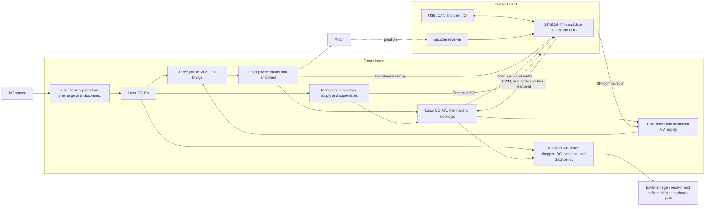

# Modular 56 V ODrive — architecture study, milestone 1

Date: 2026-09-09 (Europe/Madrid). Status: **proposal for review**, not an adopted
partition, hardware implementation, production BOM or current rating.

This fulfils section 9 of the [handoff](v4-modular-56v-handoff.md). Read it with
the [draft electrical interface](v4-modular-56v-interface.md),
[component and quantitative comparison](v4-modular-56v-components.md), and
[dated procurement evidence](../spec/v4-modular-56v-procurement.json).
The technical conclusions are a fresh review of source evidence; no second
engineer or external design review is claimed.

## 1. Recommendation and decision gates

Propose **two boards**: a self-protecting power stage, including brake and input
management, and a controller carrying the MCU, encoder and host interfaces.
Use a short adjacent or stacked connection. Place the controller outside the
switch-node and heatsink projection when practical. Do not add a third board
without a quantified thermal, service or packaging benefit.

The preferred study path is STM32G474RE control with three in-phase Kelvin
shunts and INA241A2 amplifiers on the power board, carrying conditioned analog
feedback to the MCU ADCs. Its reason is current observability and low-current
accuracy for torque control. It is conditional on an actual torque-noise budget,
analog-link measurements, thermal sizing and procurement. Retain DRV8353RS as
the first gate-driver comparison baseline, including its separate VM supply.
Its CSAs would be unused in this path; that cost must be justified.

Compare a lower-cost path using the DRV8353's three low-side CSAs before choosing.
It can be preferable if calibrated error and the available sampling windows meet
the application. Do not populate both measurement systems in the final board
without a defined diagnostic purpose. Local simultaneous SAR conversion is the
fallback if analog-link error exceeds budget; an extra power-board MCU is not
required just to transfer samples.

ISC022N10NM6 is a credible MOSFET candidate, but the observed price premium and
unmatched switching test conditions do not justify selecting it yet. OptiMOS 8
remains a family-level option pending an exact device and equivalent comparison.

Before schematic implementation, review this partition and close the interface
choices. Final sizing additionally requires the inputs below. The user requested
presentation of this milestone before implementation; that is the scope boundary.

## 2. Requirements register

No additional application data had been supplied when this draft was prepared.
The old design's 40 A RMS / 80 A peak figures are historical targets, not adopted
requirements. Neither supply current nor a transistor rating establishes phase
current. Every numerical scenario in this package is explicitly illustrative.

| ID | Missing input / required bound | Consequence and closure evidence |
|---|---|---|
| R1 | Source model; nominal, tolerance and maximum normal voltage; meaning of 56 V; startup/line transients | Establish DC-bus operating and transient envelopes, UV/OV thresholds and all pin/capacitor ratings; source datasheet and measurements |
| R2 | Continuous phase RMS current, instantaneous peak and duration/repetition; DC input current separately | Size bridge, shunts, terminals, copper, fuse and cooling from phase and bus waveforms |
| R3 | Motor model, winding connection, phase vs line-line R/L, pole pairs, torque constant convention, inertia and speed limit | Derive ripple, current-rise fault time, torque conversion and regenerative energy |
| R4 | Encoder model, supply/current, ABI/SPI/BiSS/other protocol, cable length and update rate | Pin/package budget, receiver circuitry, latency and loss-of-position behavior |
| R5 | Supply reverse-current capability; maximum returned energy/power and repetition, including hand-driven wheel and abrupt disconnect | Brake resistor pulse/average rating, bus hold-up, input blocking and fault containment |
| R6 | Ambient range, airflow/fan, sink and mounting, duty cycle and accessible enclosure surfaces | Thermal model and actual continuous rating; no mechanical restriction is not unlimited cooling |
| R7 | Torque error/noise, minimum useful torque, bandwidth, PWM/current/position rates and acoustic preference | Choose sensing topology, gain, ADC resolution, filtering and loop timing |
| R8 | USB force-feedback HID vs ODrive protocol; CAN/CAN-FD behavior, host update/loss timeout and boot/update needs | Firmware scope, flash/RAM, communications load and compatibility acceptance |
| R9 | External stop behavior, restart policy, loss-of-brake response, chassis/PE and host-ground arrangement | Hardware fault contract, isolation decision and physical stop tests |

The illustrative 56 V, 20 kHz and 20/40 A cases are sensitivity points, not
limits to implement in firmware. Obtain R1–R6 before purchasing or freezing a BOM.
R7–R9 must be agreed before accepting the electrical interface and firmware target.

## 3. Functional allocation



This diagram shows the preferred in-phase sensing option. In the low-side option,
the shunts move into the bridge returns; neither their Kelvin wiring nor gates
cross the connector. Input current and motor phase current have separate paths.

| Power board responsibility | Why it belongs here |
|---|---|
| MOSFETs, driver, charge pump, gate resistors/pulldowns, snubbers, ceramic DC link and bulk capacitors | Minimize commutation and gate-loop inductance; qualify simultaneous switching and current sharing |
| Shunts, amplifiers, analog filtering and local current comparators | Keep Kelvin loops short; retain hardware shutdown without ADC/firmware |
| Independent bus OV divider/reference, thermal trip, stop input, arm latch and external watchdog | Fault removal must not require a controller or functioning connector |
| Input protection, precharge/bypass, local brake switch/driver/shunt, load connectors | Keep regenerative current out of the interface; retain energy management after motor disable |
| Separate VM and protected auxiliary distribution | A gate-driver or controller-rail short must not directly remove brake supervision |
| Bus/current/gate test points, local fault indicators and current-limited injection points | Test the board with a fixture before a custom controller exists |

Controller: MCU/reset/clock/SWD, ADC receiving/filtering, USB/CAN transceivers and
protection, encoder supply/receiver and user I/O. Motor thermistor may enter here
with the encoder harness; power-stage and brake temperatures remain local.

## 4. Power, grounding and regenerative energy

Proposed supply tree: DC link to the DRV8353RS buck for VM only; a separate
LM5164 auxiliary source to local brake/protection supplies and a protected 5 V
controller feed. The controller derives its own digital and analog 3.3 V.
Power-side analog references remain local and are monitored across the interface.
These rail values are draft choices evaluated in the interface, not fixed parts.

Reusing the mono VM topology avoids directly sharing VM with supervision, but
its [driver-supply study](v4-mono-56v-driver-supply.md) already identifies material
internal heat and unresolved start-up behavior. Separate converters still share
the DC link. Size branch limiting and hold-up from fault energy; merely drawing
two rails does not prove fault independence. Fan/encoder inrush must not brown
out the brake logic. USB VBUS must not energize the power stage through GPIO.

Use a continuous signal reference across the short interconnect, with adjacent
returns. Keep bridge and brake current paths local; constrain their impedance
and coupling instead of relying on AGND/PGND net names. Do not insert a ferrite
in the only digital signal return. Scope common-ground operation as the initial
prototype case. Resolve host USB/shield, CAN, encoder shield, motor case and PE
paths before deciding whether isolation belongs at external ports or between
boards. Inter-board isolation would require isolated rails and a redesigned
feedback path with bounded delay; reserve it as an alternative, not a promise.

Regeneration is a separate protection problem:

```text
E_rotor = 0.5 J (omega_initial^2 - omega_final^2)
E_returned also includes hand work and stored winding energy, less actual losses
E_bus_margin = 0.5 C_effective (V_limit^2 - V_brake_on,max^2)
V_after_delay = sqrt(V_start^2 + 2 P_net t_response / C_effective)
P_brake,on = V_bus^2 / R_hot;  E_pulse = integral(P_brake dt)
```

At illustrative C=1.76 mF, the 56→60 V margin is only 0.40832 J: 100 W
unabsorbed input consumes it in 4.0832 ms. At 60 V, 4.7 Ω absorbs 766 W while
on and carries 12.77 A; 150 Ω absorbs 24 W. These examples omit tolerances,
parasitics and concurrent source power and select neither load nor threshold.
The mono's 4.7 Ω and cooled 150 Ω directions therefore cannot be copied as
qualified modular braking. A passive bleed resistor can discharge a parked bus;
it cannot be credited with arbitrary motor regeneration.

Require the complete worst-case ordering:

```text
maximum normal source < earliest normal brake activation
latest normal brake activation + dynamic rise < earliest emergency OV action
latest emergency OV action + remaining rise/overshoot < weakest derated device limit
```

Normal brake hysteresis must not chatter against source tolerance. Coordinate
TVS stand-off and worst clamp at actual pulse current with every exposed pin,
not just MOSFET VDS. Specify fuse DC interrupt rating and let-through energy,
precharge energy/time/bypass failure, polarity/reverse-current behavior and
disconnect sequencing. A source disconnect does not interrupt motor rectification.
A crowbar is only an option after fuse/source/energy coordination, not an assumed
solution. Emergency motor inhibit leaves the local brake available unless its
own OC/thermal fault forbids it. Loss of braking must inhibit motor operation
and has to be contained within a specified passive/backup energy envelope.

## 5. Reuse and redesign assessment

| Existing evidence / circuit | Modular disposition |
|---|---|
| Corrected FET, driver, protection and load-switch symbols and pin contract | Reuse manufacturer mapping evidence for the exact same MPN only; export and compare anew after hierarchy changes |
| MOSFET land and local gate/power geometry | Recheck exact TSON/TDSON drawing, paste, thermal pad and cooling; redesign power cells, do not preserve routes because they passed DRC |
| Dedicated VM buck and corrected LM5164 ripple circuit | Useful starting calculations and failure analysis; recompute loading, startup, limiting and heat for the selected FET count/gate charge |
| Independent OV sensor, motor arm and fault-priority brake latch | Reuse principles and test sequences; redesign thresholds, independent watchdog/stop, reset behavior and power-loss energy handling |
| CSS4J Kelvin and LTO100 footprints | Prepared evidence, not installed/qualified parts; check revision, terminal roles, solder process and mechanical loads before reuse |
| Mono low-side CSA filters and shunt scaling | Only usable for the low-side option after timing/noise review; redesign for in-phase sensing and independent references |
| F405 peripheral drivers and timing ownership | Keep as F405 reference/test fixture code; port timer/ADC/DMA/IRQ/SPI and fault ownership for G4 |
| Pure C++ current conversion, stale-frame rejection, driver register session and host tests | Reuse reviewed algorithms and negative-test ideas after adapting channel count, reference model and limits; tests are not a working FOC port |
| USB/CAN/encoder and auxiliary mux | Functional reference only; new MCU pin audit, USB supply/PHY guidance, ESD placement, protocol and cable review required |
| Mono stackup, traces, zones, renders and historical BOM | No fabrication or current-rating reuse; choose actual stackups and copper weights separately for the two boards |

Evidence reviewed includes [main recovery handoff](HANDOFF.md),
[first review](v4-mono-56v-first-review.md),
[acceptance status](v4-mono-56v-implementation.md),
[USB/stackup checkpoint](v4-mono-56v-usb-mcu.md),
[shunts](v4-mono-56v-shunt-review.md),
[brake load](v4-mono-56v-brake-load.md),
[brake OC](v4-mono-56v-brake-oc.md),
[brake mounting](v4-mono-56v-brake-mount.md),
[OV correction](v4-mono-56v-ov-protection.md),
[phase-current contract](v4-mono-56v-phase-current.md),
[firmware survey](firmware-port.md), [log](LOG.md) and
[historical design](v4-design.md). In particular, the old pin faults and 63 V
bulk-bank concerns are historical; the checkpoint has corrected mappings and
100 V bulk selections, with global electrical validation still unfinished.

## 6. Next schematic scope and validation plan

### Proposed preparation before custom power hardware

Following the discussion of difficulty and hazards, propose an initial
**documented low-energy development platform** before fabricating the custom
power board. This adds a learning and measurement gate; the first custom board
would still be power, with a development MCU board as its initial controller.
The approach remains a proposal. No evaluation hardware has been purchased or
selected as a substitute for the final 56 V stage.

1. Record the available motor/source, instruments, budget and hands-on experience.
   Establish the final torque/current envelope and who will perform physical
   measurements. Instrument and review access belongs in the project budget.
2. Select a supported development kit with a small motor and matched supply.
   Establish a reproducible firmware build, current measurement and limited
   current control, then reset/command-loss behavior. Encoder-based position and
   torque operation require explicit hardware and firmware support; a sensorless
   motor demo does not close that requirement.
3. In parallel, complete the custom-stage requirements, component calculations,
   interface and fault review. Retain the present shortlist as conditional;
   do not freeze in-phase amplifiers before comparing actual acquisition needs.
4. Review the power schematic and layout with an engineer experienced in motor
   inverters before fabrication. The first revision includes accessible test
   points and separable supplies. Budget for a revision after measurement.
5. Bring up that custom stage using the proposed G474 fixture and V3–V6 below.
   Validate acquisition/timing after every hardware or MCU change. Design the
   final custom control board after its interface is demonstrated.

One concrete learning-platform candidate is ST's
[P-NUCLEO-IHM03](https://www.st.com/en/evaluation-tools/p-nucleo-ihm03.html),
which combines a NUCLEO-G431RB, X-NUCLEO-IHM16M1, small gimbal motor and a 12 V
supply. It uses a **G431**, not the proposed G474, and has its own power-stage
limits. It would teach the measurement/control workflow; its firmware, pin map,
current sensing and ratings do not validate or directly replace our design.
Confirm kit contents, supported software, encoder integration and sourcing
before selecting it. The motor's permitted voltage also constrains testing,
independently of the expansion board's input range.

The [TI DRV8353RS-EVM](https://www.ti.com/tool/DRV8353RS-EVM) is a closer
gate-driver reference for later investigation. It is not assumed compatible
with a Nucleo or an inherently low-risk learning kit. Its controller connection,
supplies, firmware and protection/energy limits need their own review.

### Custom schematic and acceptance gates

After milestone review, propose a complete independently testable power-board
schematic with six sheets: (1) input/DC link/precharge; (2) bridge/driver/VM;
(3) chosen current acquisition; (4) brake/load/OC/thermal;
(5) auxiliary supplies/supervisors; (6) interconnect/watchdog/arm/stop/test points.
Select FET parallel count from losses; do not inherit twelve bridge FETs by default.

| Gate | Work and required evidence | Exit condition |
|---|---|---|
| V0 — architecture | Review this package, application bounds and interface choices | Agreed sensing/ADC/isolation/rail strategy and requirements, with owners for remaining inputs |
| V1 — electrical | Pin/package audit, netlist contracts, worst-case voltage/current/error and thermal models, fault truth tables, ERC and readable sheets | Every critical MPN and physical terminal audited; no unresolved sizing or protection dependency concealed by ERC |
| V2 — controller fixture | NUCLEO-G474RE adapter, current/voltage signal injection, timer/ADC/DMA and firmware timing under USB/CAN load | Correct polarity/scale, sample timestamps, bounded skew/jitter, break response, no automatic rearm; memory/link and host protocol assessed |
| V3 — power rails and faults | No motor; limited-energy supply, rails alone, precharge, every reset/order/unplug/short/watchdog/stop case | Gates inhibited by default, no backfeed, independent brake behavior and measured hold-up within the energy envelope |
| V4 — switching and acquisition | Begin at low bus voltage with limited current; gate probes, inductive test load and calibrated current probe | VGS/VDS overshoot, dead time, false turn-on, CSA settling, Kelvin pickup and OC delay meet derived margins; double-pulse tests before raising energy |
| V5 — current and torque loops | Restrained low-energy motor fixture; verify encoder direction and electrical angle before torque commands | Stable calibrated current loop, bounded torque error/noise, encoder/host loss and saturation responses; then mechanical loop validation |
| V6 — full envelope | Increase voltage/current/duty incrementally; worst ambient, regen pulses, missing brake, source disconnect and thermal soak | Measured semiconductor/shunt/connector/capacitor temperatures and energy/protection margins cover R1–R9 |
| V7 — manufacture | Actual stackups, DRC/parity, DFM, exact BOM/positions/exports and fresh assembly quote | Controlled reproducible release; ERC/DRC never substitutes for V3–V6 |

The [ST NUCLEO-G474RE](https://www.st.com/en/evaluation-tools/nucleo-g474re.html)
provides an MCU/debugger starting point. Audit the actual board revision and
header pin exposure, solder bridges and USB supply paths before designing the
adapter; a generic Nucleo header is not the power-stage connector. First emulate
the power board's signals with the bridge disconnected. No EVM current rating
is transferred to this custom stage. Physical validation needs bench equipment.

## 7. Workspace and evidence checks

Created `.worktrees/odrive-modular`, branch `feat/odrive-modular`, at
`cef2226b5a3262571808c2cb0893356bf0832657`. Local `feature/odrive`, its remote
tracking reference and a fresh `git ls-remote` result agree. SSH initially failed
under the sandbox; a read-only network retry succeeded without changing SSH files.
Original mono worktree status was clean; ignored scratch and generated files
were left in place. The unrelated dirty main worktree was preserved.

KiCad CLI reports 10.0.4. The 123 tracked files under ODrive `kicad/` and
`firmware/` match the original worktree byte for byte. Saved mono PCB SHA-256:
`0318f695204e05bd717395df5c9b26dcff41d8943abe5f837eaf15bec4e1bc4b`.
The historical 381 opens / 415 warnings / zero other DRC errors and 52 host tests
are checkpoint results, not fresh checks performed by this documentation study.
No KiCad, library or firmware mutation was needed. Konnect's required CAD workflow
and skill must be consulted before subsequent CAD implementation.

JLCPCB MCP observations and their source distinctions are recorded with the
component comparison. Scratch is supporting evidence only; the documents and
compact procurement JSON remain usable without it. No purchase, upload,
schematic creation, implementation commit or push is part of this milestone.
